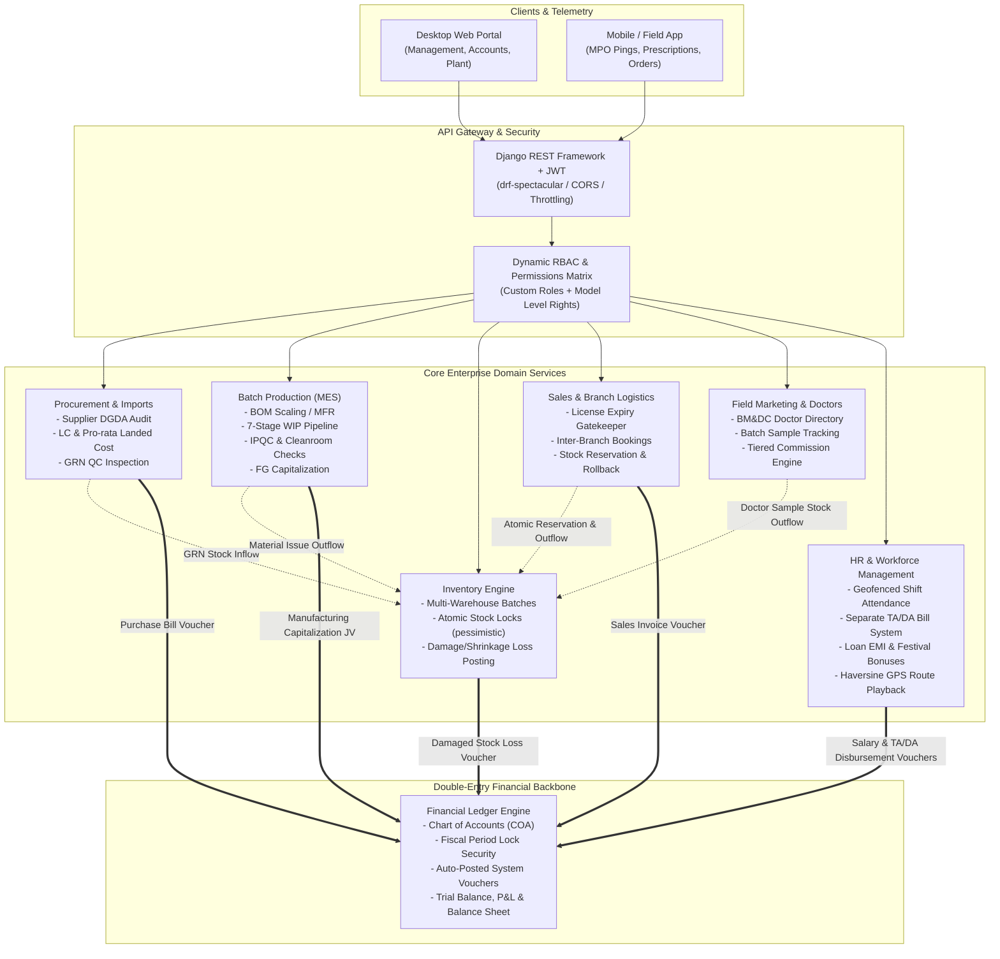

<div align="center">

# 🏥 Crescent Pharma ERP & Manufacturing Execution System (MES)
### *Enterprise-Grade Pharmaceutical Resource Planning, BMR Production & Financial Accounting Engine*

[](https://www.python.org/)
[](https://www.djangoproject.com/)
[](https://www.django-rest-framework.org/)
[](https://www.postgresql.org/)
[](https://www.docker.com/)
[](http://127.0.0.1:8000/swagger/)
[]()

<p align="center">
  <b>A mission-critical enterprise backend designed for pharmaceutical manufacturers, distributors, and field medical operations.</b><br>
  Engineered with strict statutory compliance (DGDA & NBR standards), real-time double-entry general ledger posting, atomic concurrency handling, and full GMP batch lifecycle tracing.
</p>

[Explore API Docs](#-interactive-api-documentation) • [System Architecture](#-system-architecture) • [Core Engineering Highlights](#-core-engineering--architectural-highlights) • [Installation](#-quickstart--installation)

---

</div>

## 📌 Executive Summary

**Crescent Pharma ERP** is not a standard CRUD application. It is a full-scale, distributed enterprise resource management solution specifically architected for the strict demands of the pharmaceutical industry. 

The backend coordinates nine mission-critical domains:
1. **Automated Double-Entry Accounting**: Self-balancing General Ledger ($\sum \text{Debits} = \sum \text{Credits}$), P&L, Balance Sheet, and Mushak VAT reporting.
2. **Batch Manufacturing Records (BMR) & IPQC**: Master Formula Record (MFR/BOM) scaling, cleanroom suite line allocations, in-process testing, and capitalization journal vouchers.
3. **Regulatory Gatekeeping (DGDA Compliance)**: Active verification of pharmacy drug licenses, vendor GMP status, and import blocklists before transaction issuance.
4. **Supply Chain & Landed Cost Engine**: International Letters of Credit (LC), customs duties allocation (CD, RD, SD, VAT, AIT, AT), and Goods Received Notes (GRN).
5. **Field Force Automation & Live GPS Tracking**: Geofenced shift attendance, live telemetry with Haversine distance calculations, and offline batch sync.

---

## 🏗️ System Architecture



---

## 💎 Core Engineering & Architectural Highlights

### 1. Mathematical Double-Entry Financial Engine (`accounting`)
* **Real-time Event-Driven Integration**: When operations happen across Sales, Purchases, Production, Inventory Write-offs, or Payroll, double-entry financial vouchers (`JV`, `PIV`, `SIV`, `PYV`, `CPV`, `CRV`) are posted atomically into the General Ledger.
* **Strict Balance Enforcer**: Rejects any transaction where $\sum \text{Debit} \neq \sum \text{Credit}$ or when posting to group/folder accounts.
* **Fiscal Period Lock Security**: Prevents back-dated postings into closed fiscal years or locked monthly periods.
* **Instant Financial Reports**: Dynamically computes Trial Balance, General Ledger statements with running balances, Profit & Loss (COGS, OPEX, Gross Profit), Balance Sheet ($\text{Assets} = \text{Liabilities} + \text{Equity} + \text{Retained Profit}$), and Bangladesh NBR Mushak VAT sub-ledgers.

### 2. Pharmaceutical Good Manufacturing Practice (GMP / BMR) (`production`)
* **Dynamic Recipe Scaling (BOM/MRP)**: Automatically calculates active pharmaceutical ingredients (API), excipients, and packaging needs based on batch size and expected process scrap:
  $$\text{Required Qty} = \left(\frac{\text{Batch Target Qty}}{\text{Standard Batch Size}}\right) \times \text{Standard Qty} \times \left(1 + \frac{\text{Wastage \%}}{100}\right)$$
* **7-Stage WIP State Machine**: Enforces pharmaceutical progression: `PLANNED` $\to$ `MIXING` $\to$ `PROCESSING` $\to$ `FILLING` $\to$ `PACKAGING` $\to$ `QC_PENDING` $\to$ `FINISHED`.
* **In-Process Quality Control (IPQC)**: Records cleanroom environmental conditions (temperature, humidity) and laboratory test results (pH, friability, disintegration, hardness).
* **Finished Goods Transfer (FGT)**: Automatically capitalizes raw material and packaging costs into commercial finished goods stock via automated Journal Vouchers (`JV`).

### 3. Concurrency-Safe Inventory & Batch Tracking (`inventory`)
* **Pessimistic Row-Level Locking**: Uses database-level `select_for_update()` inside atomic transactions to handle concurrent sales order bookings and prevent overselling.
* **Batch & Expiry Segregation**: Tracks stock levels per product, per warehouse, and per manufacturing batch with strict expiry date monitoring and reorder alerts.
* **Audited Write-offs & Shrinkage**: Detects inventory damage and audit physical discrepancies, immediately booking financial losses to account `5300 (Damaged Stock Loss)` and updating balance sheet asset valuations.

### 4. Import LC Management & Pro-Rata Landed Cost (`purchases`)
* **Trade Lifecycle Pipeline**: Manages import Letters of Credit through stages: `APPLICATION` $\to$ `OPENED` $\to$ `SHIPPED` $\to$ `PORT_ARRIVED` $\to$ `CUSTOMS_CLEARED` $\to$ `RECEIVED` $\to$ `CLOSED`.
* **Pro-Rata Landed Cost Allocation**: Aggregates base foreign exchange, customs duties (CD, RD, SD, VAT, AIT, AT), marine insurance, freight, and C&F fees, apportioning them pro-rata across PO line items to update real unit purchase prices.
* **Auto Margin Voucher**: Automatically debits LC margin assets and credits corporate bank accounts upon opening.

### 5. Field Telemetry & Geofenced Workforce Automation (`hr` & `marketing`)
* **Geofenced Shift Attendance**: Validates check-in locations against active office coordinates using the **Haversine Great-Circle Formula**:
  $$d = 2R \arcsin\left(\sqrt{\sin^2\left(\frac{\Delta \phi}{2}\right) + \cos(\phi_1)\cos(\phi_2)\sin^2\left(\frac{\Delta \lambda}{2}\right)}\right)$$
* **Reverse Geocoding**: Automatically translates latitude/longitude into human-readable street/city addresses for remote field personnel via OpenStreetMap Nominatim.
* **High-Frequency GPS Playback**: Stores MPO location pings with speed, accuracy, and battery levels, filtering out GPS teleport noise (>50km jumps) to calculate verified daily field mileage.
* **Separated TA/DA Billing**: Decoupled from payslips; calculates allowances strictly on **verified attended working days** (excluding public holidays, weekly off-days, and leaves).

---

## 🧩 Module Breakdown & Capabilities

| Module | Primary Responsibility | Key Technical Highlight |
| :--- | :--- | :--- |
| **`users`** | Identity, Role-Based Access Control (RBAC), Dual-Shift Timing | Auto `EMP-XXXX` numbering, prefetched permissions cache avoiding N+1 queries. |
| **`core`** | System Lookups, Audit Logs, Singleton Company Profile, KPI Dashboard | Single-pass SQL aggregation with conditional `Case(When(...))` for instant KPI loading. |
| **`hr`** | Payroll, Attendance, Loans, Leave, TA/DA, GPS Tracking | Automated attendance sync on approved leave, loan EMI schedules, Haversine route parser. |
| **`inventory`** | Batch/Lot Control, Warehouses, Stock Movement Ledger | Atomic reservation, expiry cutoff filters, automated ledger write-off hooks. |
| **`purchases`** | Supplier DGDA Verification, Multi-Currency POs, LC & GRN | Pro-rata landed cost distributor, automated purchase bill voucher posting. |
| **`production`**| BOM Formulations, BMR Manufacturing, IPQC, Line Suite Allocations | Dynamic MRP ingredient scaling, WIP state machine, automated capitalization JV. |
| **`sales`** | Customer Directory, Order Processing, Inter-Branch Bookings | DGDA license expiry gatekeeper, draft vs confirmed reservation logic, order rollback. |
| **`marketing`**| Doctors (BM&DC), Physician Sample Tracking, MPO Closings | Tiered incentive algorithms (80%, 100%, 120%), batch sample inventory deduction. |
| **`accounting`**| Chart of Accounts (COA), Multi-Period Ledger, Financial Statements | Strict double-entry balance check ($\sum\text{Dr} = \sum\text{Cr}$), period locks, automated BRS. |

---

## 🛠️ Technology Stack & Dependencies

* **Language**: Python 3.10 / 3.11
* **Web Framework**: Django 5.x, Django REST Framework (DRF)
* **Authentication**: Django REST Framework SimpleJWT
* **API Documentation**: OpenAPI 3.0 via `drf-spectacular` & Swagger UI
* **Database**: PostgreSQL (Production) / SQLite3 (Development)
* **Containerization**: Docker & Docker Compose
* **Algorithms & Math**: Haversine Spherical Distance, Decimal Rounding (`ROUND_HALF_UP`)
* **GIS & Geocoding**: OpenStreetMap Nominatim API Integration

---

## 🚀 Quickstart & Installation

### Prerequisites
* Python 3.10+
* Git
* Virtualenv
* PostgreSQL (Optional, SQLite works out of the box for testing)

### 1. Clone & Set Up Virtual Environment
```bash
# Clone the repository
git clone https://github.com/your-username/crescent-pharma-backend.git
cd crescent-pharma-backend

# Create and activate virtual environment
python -m venv venv
# On Windows:
venv\Scripts\activate
# On Linux/macOS:
source venv/bin/activate

# Install dependencies
pip install -r requirements.txt
```

### 2. Environment Configuration
Create a `.env` file in the root directory (or use default development settings):
```env
SECRET_KEY=your-secure-secret-key
DEBUG=True
ALLOWED_HOSTS=*
DATABASE_URL=sqlite:///db.sqlite3
```

### 3. Run Migrations & Seed Initial Data
```bash
# Apply schema migrations
python manage.py migrate

# Create superuser (Admin)
python manage.py createsuperuser
```

### 4. Launch Development Server
```bash
python manage.py runserver
```
The API server will start at `http://127.0.0.1:8000/`.

---

## 🐳 Docker Deployment

The application is containerized with Docker and Docker Compose for production readiness:

```bash
# Build and run containers in detached mode
docker-compose up -d --build

# Run migrations inside container
docker-compose exec web python manage.py migrate
```

---

## 📖 Interactive API Documentation

Crescent Pharma ERP provides comprehensive interactive Swagger documentation:

* **Swagger UI**: [`http://127.0.0.1:8000/swagger/`](http://127.0.0.1:8000/swagger/)
* **OpenAPI 3.0 Schema**: [`http://127.0.0.1:8000/api/schema/`](http://127.0.0.1:8000/api/schema/)

### Core Endpoint Directory
```http
POST /api/auth/login/                             # User & Employee Login (Returns JWT + Profile)
GET  /api/core/dashboard/summary/                 # Real-time Sales, Income & Expenses KPI
POST /api/attendance/check-in/                    # Geofenced Shift Check-in / Check-out
POST /api/tracking/ping/                          # Real-time MPO GPS Telemetry Ping
GET  /api/tracking/mpo-route/                     # MPO Verified Route Playback & Kilometers
POST /api/payroll/generate/                       # Generate Prorated Monthly Payroll + Bonus
POST /api/allowance-bills/generate/               # Calculate TA/DA Allowance Bill from Observed Days
GET  /api/products/low-stock/                     # Reorder Point Stock Alerts
POST /api/purchases/orders/{id}/approve/          # Approve Purchase Order (DGDA license validated)
POST /api/purchases/letters-of-credit/            # Open Import LC & Post Bank Margin Voucher
POST /api/purchases/grn/{id}/approve/             # Inflow Accepted Goods & Post Purchase Bill
GET  /api/production/boms/{id}/estimate/          # Calculate Material Requirements (MRP Scaling)
POST /api/production/batches/{id}/complete/       # Finalize Batch & Capitalize Costs (JV Voucher)
POST /api/customer-orders/{id}/deliver/           # Deliver Order, Deduct Stock & Post Sales Voucher
GET  /api/marketing/targets/{id}/achievement/     # Calculate Sales Achievement & Tiered Incentives
GET  /api/accounting/reports/trial-balance/       # Trial Balance (Debit == Credit verification)
GET  /api/accounting/reports/profit-and-loss/     # Real-time Income Statement (P&L)
GET  /api/accounting/reports/balance-sheet/       # Balance Sheet (Assets = Liabilities + Equity)
```

---

## 🧪 Testing & Reliability

Comprehensive test suites cover core business domains, accounting equation integrity, geofencing, and BOM formulation scaling:

```bash
# Run all test suites
python manage.py test

# Run tests for specific modules
python manage.py test accounting
python manage.py test production
python manage.py test hr
```

---

## 👨‍💻 Engineering Practices & Code Quality

* **Transactional Atomicity**: All multi-table operations (such as GRN approval, batch completion, and payroll disbursement) are enclosed in `transaction.atomic()` blocks to prevent partial writes.
* **Zero Race Conditions**: Critical increment/decrement operations (stock reservation, sequential document numbers `ORD-`, `PO-`, `BATCH-`, `JV-`) employ `select_for_update()` locking.
* **Optimized Database Queries**: Eliminates N+1 query bottlenecks through extensive use of `select_related()` on foreign keys and `prefetch_related()` on many-to-many relationships.
* **Auditability & Reversibility**: Strict adherence to financial audit principles — posted transactions cannot be deleted; they must be reversed via structured reversal vouchers.

---

<div align="center">
  <b>Crafted with ❤️ for High-Scale Enterprise Engineering</b><br>
  <i>Showcasing Advanced Backend Architecture, Financial Computing & Clean Code</i>
</div>
